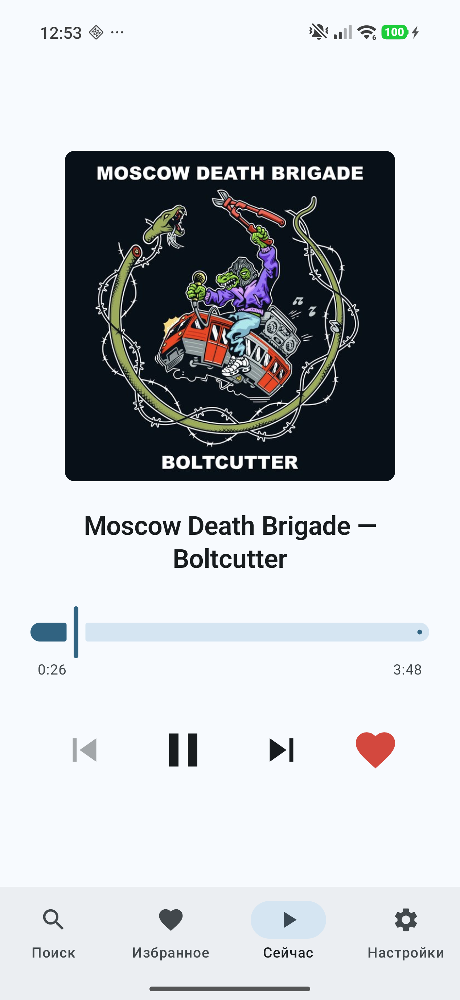
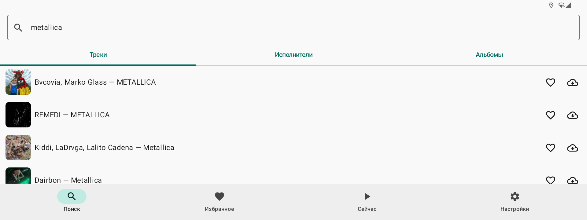
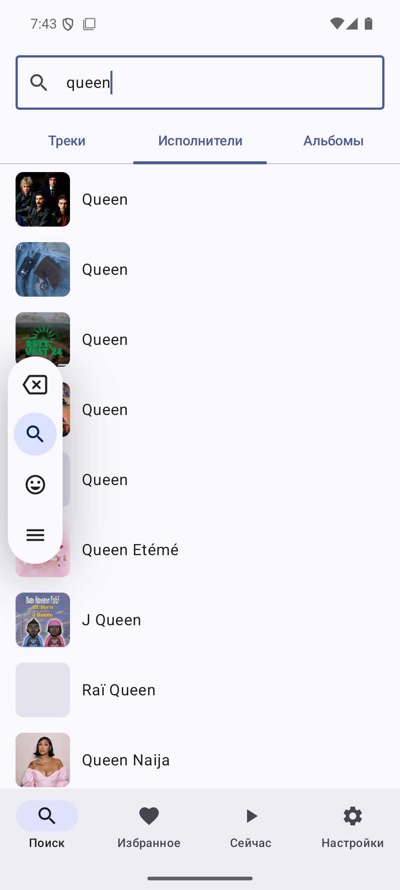
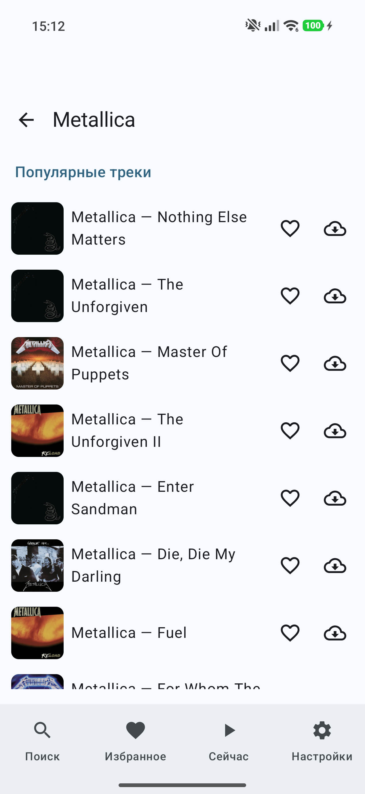
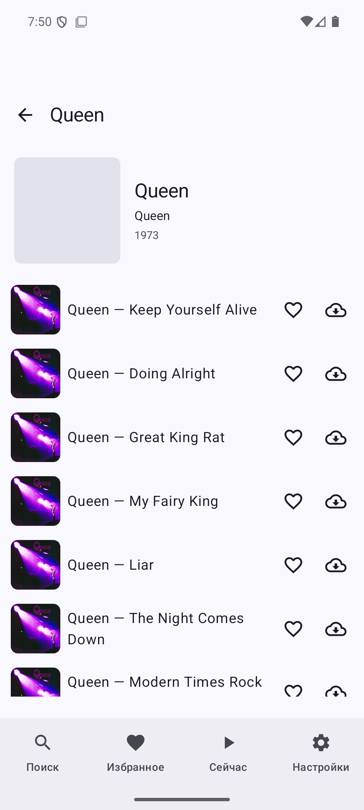
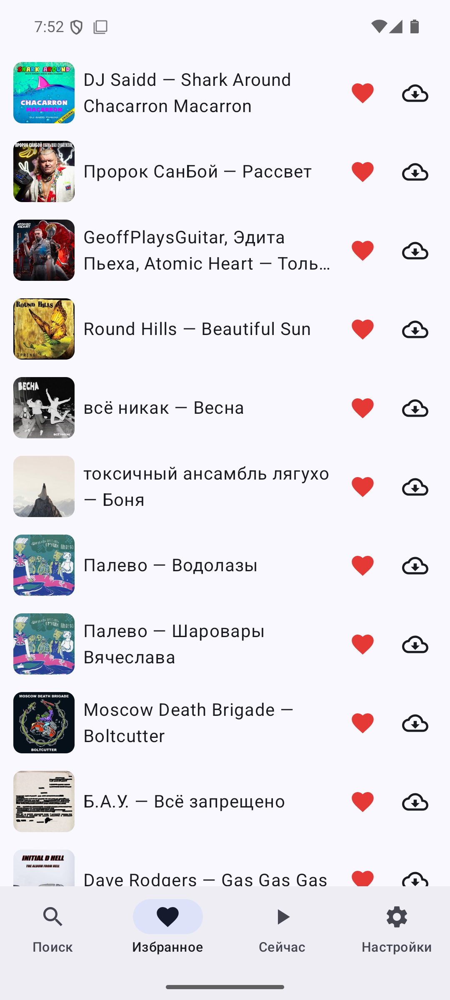
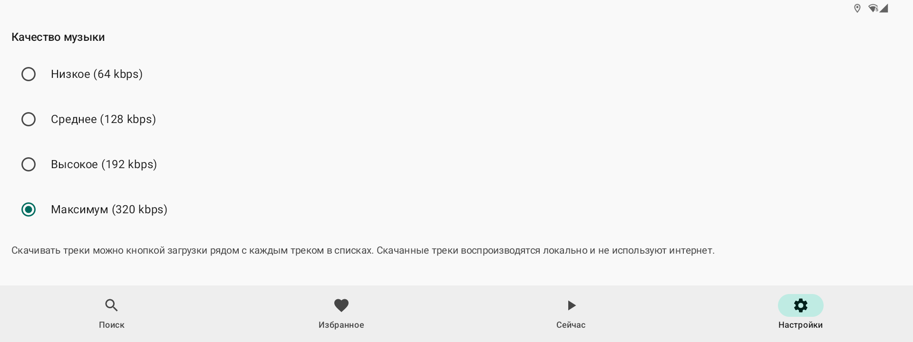

# YaMuLite

An unofficial Android client for Yandex Music, written in Kotlin with Jetpack Compose. Plays tracks, manages likes, downloads music for offline listening, and adapts to both phone screens and wide automotive head units.

<p align="center">
  
</p>

## Features

- **OAuth 2.0 device flow** sign-in (no password ever leaves Yandex's site)
- **Search** tracks, artists and albums with debounced queries
- **Artist** page with popular tracks and full discography
- **Album** page with the complete track list, cover, year and artists
- **Favorites** — server-synced liked tracks
- **Now Playing** — large cover, transport controls, seek bar with position / duration, like toggle, adaptive layout for landscape/wide screens
- **Offline downloads** — per-track download with progress, stored in app-private storage
- **Quality selector** — Low / Normal / High / Best, applied to both streaming and downloads
- **Material 3** with bottom navigation (Search / Favorites / Now Playing / Settings)
- **Coil** for cover art, sharing the app's OkHttp connection pool
- **Media3 ExoPlayer** for playback, with automatic fallback to local files when a track has been downloaded

## Screenshots

| Search — tracks | Search — artists |
|:--:|:--:|
|  |  |

| Artist | Album |
|:--:|:--:|
|  |  |

| Favorites | Settings |
|:--:|:--:|
|  |  |

## Tech stack

| Area | Library |
|---|---|
| Language | Kotlin 2.0.21 |
| UI | Jetpack Compose (BOM 2024.12.01), Material 3 |
| DI | Hilt 2.52 (via KSP 2.0.21-1.0.28) |
| Navigation | Navigation Compose 2.8.5 |
| Networking | Retrofit 2.11.0, OkHttp 4.12.0, kotlinx.serialization 1.7.3 |
| Images | Coil 3.0.4 |
| Playback | Media3 ExoPlayer 1.5.1 |
| Storage | DataStore Preferences 1.1.1 |

`compileSdk = 36`, `targetSdk = 36`, `minSdk = 26` (Android 8+).

> Kotlin is intentionally pinned to **2.0.21** — Hilt 2.52's metadata reader cannot parse Kotlin 2.1 metadata. Bump Hilt first if you want Kotlin 2.1.

## Download

A pre-built debug APK is available in [`latest/yamulite.apk`](latest/yamulite.apk).

```bash
adb install -r latest/yamulite.apk
```

## Build & install

The Gradle build needs JDK 17:

```bash
export JAVA_HOME=/opt/homebrew/opt/openjdk@17/libexec/openjdk.jdk/Contents/Home
./gradlew :app:assembleDebug

adb install -r app/build/outputs/apk/debug/app-debug.apk
adb shell am start -n dev.pdv.yamulite/.MainActivity
```

`local.properties` must contain `sdk.dir=...`. The Android SDK should have `platform-tools`, `platforms;android-36`, `build-tools;36.1.0`, `cmdline-tools;latest`, with all licenses accepted.

The debug APK is ~21 MB. First build takes about a minute (downloading dependencies); incremental builds finish in ~5 seconds.

## Architecture notes

- **Reactive auth gate.** `AppViewModel.gate` derives from `TokenStore.tokenFlow`. `AppRoot` switches between `AuthScreen` and `MainScreen` based on whether a token exists — there is no manual navigation after sign-in.
- **Two Retrofit instances.** `@AuthRetrofit` talks to `oauth.yandex.ru`; `@MusicRetrofit` talks to `api.music.yandex.net` and applies an `AuthInterceptor` that injects the OAuth bearer.
- **Stream URL resolution** is a 3-step dance: `download-info` → CDN XML → MD5-signed URL. Only `mp3` codec is implemented.
- **Local-first playback.** `AudioPlayer.playCurrent()` checks the `DownloadManager` for a local file before doing any network call, so downloaded tracks play instantly with no internet.
- **Permissive DTOs.** Yandex's API is undocumented and inconsistent — most fields have defaults, and `TrackDto.id` uses a `FlexibleStringSerializer` because the same field arrives as a string from `/users/{uid}/likes/tracks` but as a number from `/search`.
- **Adaptive Now Playing.** On wide screens (`maxWidth > maxHeight`) the layout switches to a two-column row (cover left, title + transport controls right) so everything fits in the limited vertical space of a head unit.

## Limitations

- **FLAC subscription required for FLAC streams.** The resolver constructs `get-flac/…` URLs by analogy with the community-documented `get-mp3/get-aac` prefixes. If the URL is unreachable (e.g. no FLAC-entitled subscription), the player automatically retries with MP3. Downloads follow the same codec preference and use the correct extension (`.mp3`, `.aac`, `.flac`).

## Disclaimer

This project uses an **unofficial** API at `api.music.yandex.net` and the well-known community OAuth client (`23cabbbdc6cd418abb4b39c32c41195d`) that ships with every open-source Yandex Music library. These are not real secrets — Yandex's `device_code` grant requires a client secret, and the same pair is hardcoded everywhere in the unofficial ecosystem. To use a private OAuth client, register one at `oauth.yandex.ru/client/new` and supply your own pair.

The API may change at any time without notice; this is a hobby client and is not affiliated with or endorsed by Yandex.
